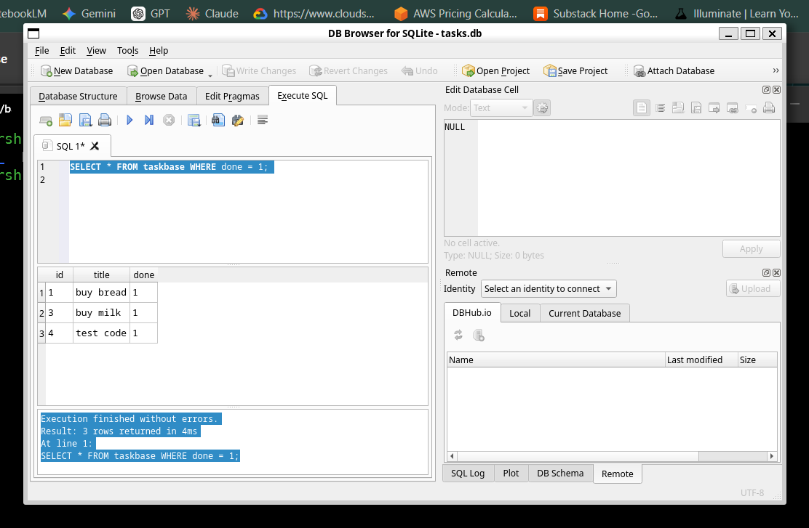

# To-Do List CRUD API

A lightweight, in-memory RESTful API built with **Python** and **FastAPI** to manage a simple to-do list. Built as part of the FlyRank Internship Backend Track (Week 2 — Assignment A1) to demonstrate HTTP request-response mechanics, CRUD operations, input validation, proper HTTP status codes, and automatic OpenAPI/Swagger documentation.

---

## 🚀 Getting Started

### Prerequisites

* **Python 3.10+**
* [uv](https://github.com/astral-sh/uv) (Python package installer & project manager)

### Installation & Running

1. **Clone the repository:**

   ```bash
   git clone [https://github.com/GovIndLok/task-crud-api.git](https://github.com/GovIndLok/task-crud-api.git)
   cd task-crud-api
    ```

2. **Sync dependencies and start the server:**

    ```bash
    uv sync
    uv run uvicorn main:app --reload --port 8000
    ```

---

## Data Exploration

To verify that the database layer independently from FastAPI routes, directly execute query from **DB Browser for SQLite** against `tasks.db`

### Example SQL query

Query:

```SQL
SELECT * FROM tasks WHERE done = 1;
```

Output:

```
Execution finished without errors.
Result: 3 rows returned in 4ms
At line 1:
SELECT * FROM taskbase WHERE done = 1;
```

Screenshot:

